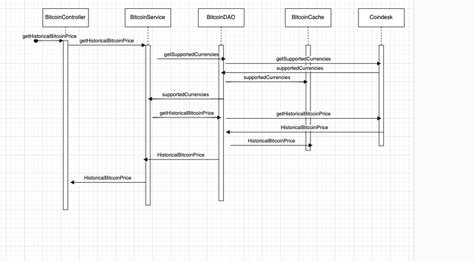

# historical-bitcoin-price-service

## Getting Started

### Dependencies

Please, download and install the following:

* Java 17
* Docker

### Building

To build the project, use Gradle:

```shell
./gradlew clean build
```
### Running

- To run the application:

    ```shell
    ./gradlew bootRun
    ```

### Sample Request

```
curl -X 'GET' \
  'http://localhost:8080/api/v1/historical-bitcoin-price?currency=USD&startDate=2022-03-02&endDate=2023-03-01' \
  -H 'accept: */*'
```

### Sample Response

```
{
    "bpi": {
        "2022-03-02": 43931.7,
        "2022-03-03": 42476.5117,
        "2022-03-04": 39165.255,
        "2022-03-05": 39411.1383,
        "2022-03-06": 38426.475,
        "2022-03-07": 38012.92,
        "2022-03-08": 38753.6467,
        "2022-03-09": 41957.5333,
        "2022-03-10": 39439.1533,
        "2022-03-11": 38739.66,
        "2022-03-12": 38814.2817,
        "2022-03-13": 37788.0583,
        "2022-03-14": 39691.7917,
        "2022-03-15": 39310.215,
        "2022-03-16": 41134.125,
        "2022-03-17": 40945.165,
        "2022-03-18": 41778.7817,
        "2022-03-19": 42228.0883,
        "2022-03-20": 41276.2617,
        "2022-03-21": 41037.885,
        "2022-03-22": 42375.065,
        "2022-03-23": 42540.7775,
        "2022-03-24": 43921.275,
        "2022-03-25": 44360.5,
        "2022-03-26": 44350.51,
        "2022-03-27": 46631.25,
        "2022-03-28": 48173.2,
        "2022-03-29": 47384.5,
        "2022-03-30": 47151.5,
        "2022-03-31": 46318.5625,
        "2022-04-01": 46154.5
    },
    "maximumRate": {
        "2022-03-28": 48173.2
    },
    "minimumRate": {
        "2022-03-13": 37788.0583
    }
}
```

### Swagger URL
http://localhost:8080/swagger-ui/index.html#/bitcoin-controller/getHistoricalBitcoinPrice





Problem Statement (Full Stack – UI, Service + CI/CD)
Develop, Test and Deploy a service to find the historical Bitcoin price along with the
highest &amp; lowest price markers for a user provided Start date, End date and Output
Currency along with the default USD value (Hint: Conversions can be done based on
the current rates).
• End user should be able to view results by changing the input parameters
• The service should be ready to be released to production or live environment
• The service should be accessible via web browser or postman (using any one of
JavaScript frameworks, HTML or JSON)
• The solution should support offline mode with toggles
• The service should return relevant results as expected, even while the underlying
dependencies (Ex: Public API) are not available!
(Use your own code/logic/data structures and without 3rd party libraries or DB)
API Data Sources
APIs
https://api.coindesk.com/v1/bpi/historical/close.json
https://api.coindesk.com/v1/bpi/supported-currencies.json
Documentation: https://www.coindesk.com/coindesk-api
Expected output
(via an UI mechanism of your choice – Ex: React page)
Date DD-MM-YYYY e.g. 01-01-2018 for each date in the range
Price along with text to show
if it’s the highest in date range i.e. Price (high) e.g. 1234.5678 (high)
if it’s the lowest in date range i.e. Price (low) e.g. 1001.343 (low)
Currency e.g. INR &amp; USD
NFRs
• Demonstrate SOLID, 12 Factor and HATEOAS principles, Design Patterns in the
design and implementation
• Demonstrate Performance, Optimization &amp; Security aspects
• Demonstrate Production readiness of the code
• Demonstrate TDD &amp; BDD &amp; Quality aspects
• Demonstrate sensitive information used in the Micro Services such as API keys are
protected / encrypted
Documentation
• Include the open-API spec./Swagger to be part of the code. Should be able to view
API via swagger (Documentation to explain the purpose of the API along with Error
codes that the service consumers &amp; client must be aware of!)
• Create a README.md file in the repository and explain the design and
implementation approach
• In the README, add a sequence diagram or flowchart created using draw.io –
https://www.draw.io
• Mention the design patterns used in the code

Build &amp; Deploy
CI
• Build CI/CD pipeline for your project(s); Pipeline scripts need to be part of the
codebase;
• Ensure the Jenkins job config., scripts are a part of the project sources
CD
• Demonstrate the service deployment using a Docker container (Create a docker
image and publish service locally)
• Ensure the docker files are a part of the project sources